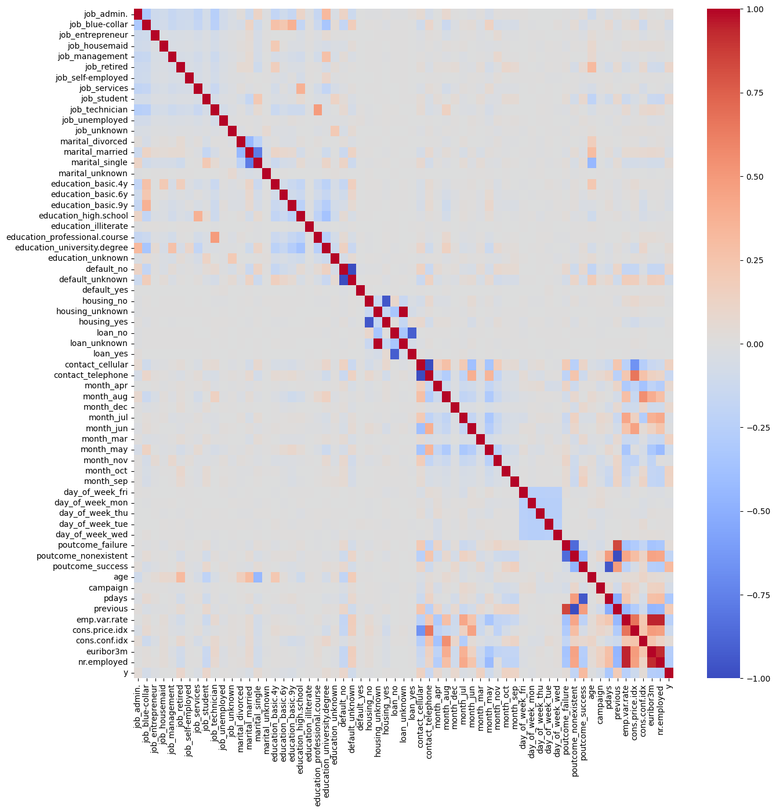

# Bank Analysis with A/B Testing on Marketing Campaign
By: Johnathan Bailey

# Table of Contents
1. [Business Understanding](#1)
2. [Model Performances](#2)
3. [Data Understanding](#3)
4. [Data Understanding](#4)
5. [Data Visualization](#5)
6. [Data Cleaning](#6)
7. [Data Processing](#7)
8. [Create Test and Train Data](#8)
9. [Decision Tree Model](#9)
10. [Logistic Regression Model](#10)
11. [Feature importance](#last-bullet)


## Business Understanding <a name="1"></a>

You are a Data Scientist with the marketing team at a banking institution. The Marketing Manager has been running phone based marketing campaigns to market the new product which is a bank term deposit. The manager has historical data from marketing campaigns in the past for a similar product. Historical data is available in full.csv dataset. Often, more than one contact to the same client was required, in order to access if the product (bank term deposit) would be ('yes') or not ('no') subscribed.

<a id="2"></a>
## Model Performances

Below are the performance metrics for both Decision Tree and Logistic Regression models. The first set is with all predicitve variables, and the second is with only a subset of the highest significant predictive variables.

Decision Tree w/ all predictive variables:
```
accuracy_train: 0.9964626268840356
accuracy_test: 0.6515478761699064
precision: 0.6504646175839885
recall: 0.6551475881929446
f1: 0.6527977044476327
mse: 0.3484521238300936
variance: 0.2499870420733512
```
Logistic Regression w/ all predictive variables:
```
accuracy_train: 0.7474623192863734
accuracy_test: 0.7293016558675306
precision: 0.7913998170173834
recall: 0.6227501799856011
f1: 0.6970185334407736
mse: 0.2706983441324694
variance: 0.23864678298738262
```

Decision Tree w/ subset of predictive variables:
```
accuracy_train: 0.7714549369424792
accuracy_test: 0.7275017998560115
precision: 0.8191919191919191
recall: 0.583873290136789
f1: 0.6817990752416981
mse: 0.27249820014398846
variance: 0.2293708511958352
```

Logistic Regression w/ subset of predictive variables:
```
accuracy_train: 0.7265456782528453
accuracy_test: 0.7170626349892009
precision: 0.7299771167048055
recall: 0.6889848812095032
f1: 0.7088888888888889
mse: 0.28293736501079914
variance: 0.24921163974268667
```
Looking at all four models, it appears that limiting the features proves to be the best perfomance. Out of the two models, it is very close but Logistic Regression wins with a slightly higher f1. The key determiner of model performance is the recall score as we are trying to accurately determine the number of true positives. The better the recall score, the better we are at determining true positives over false negatives.


```python
import numpy as np
import pandas as pd
import math

%matplotlib inline
import matplotlib.pyplot as plt
import matplotlib.style as style
from pandas.plotting import scatter_matrix

import seaborn as sns

from scipy import stats

from sklearn.model_selection import train_test_split
from sklearn.metrics import mean_squared_error
from sklearn.linear_model import LogisticRegression
from sklearn import tree
from sklearn import metrics
```

## Data Understanding


```python

data = pd.read_csv("full.csv")
data = data.drop("duration",axis=1)
data.head()
```


<div>

<table border="1" class="dataframe">
  <thead>
    <tr style="text-align: right;">
      <th></th>
      <th>age</th>
      <th>job</th>
      <th>marital</th>
      <th>education</th>
      <th>default</th>
      <th>housing</th>
      <th>loan</th>
      <th>contact</th>
      <th>month</th>
      <th>day_of_week</th>
      <th>campaign</th>
      <th>pdays</th>
      <th>previous</th>
      <th>poutcome</th>
      <th>emp.var.rate</th>
      <th>cons.price.idx</th>
      <th>cons.conf.idx</th>
      <th>euribor3m</th>
      <th>nr.employed</th>
      <th>y</th>
    </tr>
  </thead>
  <tbody>
    <tr>
      <th>0</th>
      <td>56</td>
      <td>housemaid</td>
      <td>married</td>
      <td>basic.4y</td>
      <td>no</td>
      <td>no</td>
      <td>no</td>
      <td>telephone</td>
      <td>may</td>
      <td>mon</td>
      <td>1</td>
      <td>999</td>
      <td>0</td>
      <td>nonexistent</td>
      <td>1.1</td>
      <td>93.994</td>
      <td>-36.4</td>
      <td>4.857</td>
      <td>5191.0</td>
      <td>no</td>
    </tr>
    <tr>
      <th>1</th>
      <td>57</td>
      <td>services</td>
      <td>married</td>
      <td>high.school</td>
      <td>unknown</td>
      <td>no</td>
      <td>no</td>
      <td>telephone</td>
      <td>may</td>
      <td>mon</td>
      <td>1</td>
      <td>999</td>
      <td>0</td>
      <td>nonexistent</td>
      <td>1.1</td>
      <td>93.994</td>
      <td>-36.4</td>
      <td>4.857</td>
      <td>5191.0</td>
      <td>no</td>
    </tr>
    <tr>
      <th>2</th>
      <td>37</td>
      <td>services</td>
      <td>married</td>
      <td>high.school</td>
      <td>no</td>
      <td>yes</td>
      <td>no</td>
      <td>telephone</td>
      <td>may</td>
      <td>mon</td>
      <td>1</td>
      <td>999</td>
      <td>0</td>
      <td>nonexistent</td>
      <td>1.1</td>
      <td>93.994</td>
      <td>-36.4</td>
      <td>4.857</td>
      <td>5191.0</td>
      <td>no</td>
    </tr>
    <tr>
      <th>3</th>
      <td>40</td>
      <td>admin.</td>
      <td>married</td>
      <td>basic.6y</td>
      <td>no</td>
      <td>no</td>
      <td>no</td>
      <td>telephone</td>
      <td>may</td>
      <td>mon</td>
      <td>1</td>
      <td>999</td>
      <td>0</td>
      <td>nonexistent</td>
      <td>1.1</td>
      <td>93.994</td>
      <td>-36.4</td>
      <td>4.857</td>
      <td>5191.0</td>
      <td>no</td>
    </tr>
    <tr>
      <th>4</th>
      <td>56</td>
      <td>services</td>
      <td>married</td>
      <td>high.school</td>
      <td>no</td>
      <td>no</td>
      <td>yes</td>
      <td>telephone</td>
      <td>may</td>
      <td>mon</td>
      <td>1</td>
      <td>999</td>
      <td>0</td>
      <td>nonexistent</td>
      <td>1.1</td>
      <td>93.994</td>
      <td>-36.4</td>
      <td>4.857</td>
      <td>5191.0</td>
      <td>no</td>
    </tr>
  </tbody>
</table>
</div>


```python
print("shape:",data.shape)
print("========================================")
print("info:",data.info())
print("========================================")
print(data.describe())
print("========================================")
print("missing values:",data.isnull().sum())
```

    shape: (41188, 20)
    ========================================
    <class 'pandas.core.frame.DataFrame'>
    RangeIndex: 41188 entries, 0 to 41187
    Data columns (total 20 columns):
     #   Column          Non-Null Count  Dtype  
    ---  ------          --------------  -----  
     0   age             41188 non-null  int64  
     1   job             41188 non-null  object 
     2   marital         41188 non-null  object 
     3   education       41188 non-null  object 
     4   default         41188 non-null  object 
     5   housing         41188 non-null  object 
     6   loan            41188 non-null  object 
     7   contact         41188 non-null  object 
     8   month           41188 non-null  object 
     9   day_of_week     41188 non-null  object 
     10  campaign        41188 non-null  int64  
     11  pdays           41188 non-null  int64  
     12  previous        41188 non-null  int64  
     13  poutcome        41188 non-null  object 
     14  emp.var.rate    41188 non-null  float64
     15  cons.price.idx  41188 non-null  float64
     16  cons.conf.idx   41188 non-null  float64
     17  euribor3m       41188 non-null  float64
     18  nr.employed     41188 non-null  float64
     19  y               41188 non-null  object 
    dtypes: float64(5), int64(4), object(11)
    memory usage: 6.3+ MB
    info: None
    ========================================
                   age      campaign         pdays      previous  emp.var.rate  \
    count  41188.00000  41188.000000  41188.000000  41188.000000  41188.000000   
    mean      40.02406      2.567593    962.475454      0.172963      0.081886   
    std       10.42125      2.770014    186.910907      0.494901      1.570960   
    min       17.00000      1.000000      0.000000      0.000000     -3.400000   
    25%       32.00000      1.000000    999.000000      0.000000     -1.800000   
    50%       38.00000      2.000000    999.000000      0.000000      1.100000   
    75%       47.00000      3.000000    999.000000      0.000000      1.400000   
    max       98.00000     56.000000    999.000000      7.000000      1.400000   
    
           cons.price.idx  cons.conf.idx     euribor3m   nr.employed  
    count    41188.000000   41188.000000  41188.000000  41188.000000  
    mean        93.575664     -40.502600      3.621291   5167.035911  
    std          0.578840       4.628198      1.734447     72.251528  
    min         92.201000     -50.800000      0.634000   4963.600000  
    25%         93.075000     -42.700000      1.344000   5099.100000  
    50%         93.749000     -41.800000      4.857000   5191.000000  
    75%         93.994000     -36.400000      4.961000   5228.100000  
    max         94.767000     -26.900000      5.045000   5228.100000  
    ========================================
    missing values: age               0
    job               0
    marital           0
    education         0
    default           0
    housing           0
    loan              0
    contact           0
    month             0
    day_of_week       0
    campaign          0
    pdays             0
    previous          0
    poutcome          0
    emp.var.rate      0
    cons.price.idx    0
    cons.conf.idx     0
    euribor3m         0
    nr.employed       0
    y                 0
    dtype: int64
    

Some things to note:
1. Age looks to have some outliers. A minimum of 17 is interesting in that a bank would target someone who is not a legal adult to take part in a Deposit campaign. A max age of 98 is also interesting, in that there is a chance that clients data is unrealiable due to age as well. We will need to normalize these numerical columns going into our model creation.
2. Number of employed is very interesting in that it isnt interesting at all. Looking at the min, 25, 50, 75, and max, it shows that the spread is fairly plateau of the number of employees. i.e. it doesnt waver all too much. When we go to select features to be used to help predict column y, the likelyhood of this column haveing any correlation in the outcome is rather small. Visualization and a correlation matrix should back this theory.
3. As with number of employees, pdays also looks to not be significant data. 75% of the data is exactly the same, 999 as you can see above.
4. alot of the numerical data tends to not waiver in standard deviation, or distance from the mean. This gives me the hint that the categorical data will be huge in finding y with a machine learning model.


```python
columns = data.columns
columns
```


    Index(['age', 'job', 'marital', 'education', 'default', 'housing', 'loan',
           'contact', 'month', 'day_of_week', 'campaign', 'pdays', 'previous',
           'poutcome', 'emp.var.rate', 'cons.price.idx', 'cons.conf.idx',
           'euribor3m', 'nr.employed', 'y'],
          dtype='object')


```python
numeric_data = data.select_dtypes(exclude='object')
categorical_data = data.select_dtypes(exclude=['int64','float64'])
categorical_data.head()
```


<div>

<table border="1" class="dataframe">
  <thead>
    <tr style="text-align: right;">
      <th></th>
      <th>job</th>
      <th>marital</th>
      <th>education</th>
      <th>default</th>
      <th>housing</th>
      <th>loan</th>
      <th>contact</th>
      <th>month</th>
      <th>day_of_week</th>
      <th>poutcome</th>
      <th>y</th>
    </tr>
  </thead>
  <tbody>
    <tr>
      <th>0</th>
      <td>housemaid</td>
      <td>married</td>
      <td>basic.4y</td>
      <td>no</td>
      <td>no</td>
      <td>no</td>
      <td>telephone</td>
      <td>may</td>
      <td>mon</td>
      <td>nonexistent</td>
      <td>no</td>
    </tr>
    <tr>
      <th>1</th>
      <td>services</td>
      <td>married</td>
      <td>high.school</td>
      <td>unknown</td>
      <td>no</td>
      <td>no</td>
      <td>telephone</td>
      <td>may</td>
      <td>mon</td>
      <td>nonexistent</td>
      <td>no</td>
    </tr>
    <tr>
      <th>2</th>
      <td>services</td>
      <td>married</td>
      <td>high.school</td>
      <td>no</td>
      <td>yes</td>
      <td>no</td>
      <td>telephone</td>
      <td>may</td>
      <td>mon</td>
      <td>nonexistent</td>
      <td>no</td>
    </tr>
    <tr>
      <th>3</th>
      <td>admin.</td>
      <td>married</td>
      <td>basic.6y</td>
      <td>no</td>
      <td>no</td>
      <td>no</td>
      <td>telephone</td>
      <td>may</td>
      <td>mon</td>
      <td>nonexistent</td>
      <td>no</td>
    </tr>
    <tr>
      <th>4</th>
      <td>services</td>
      <td>married</td>
      <td>high.school</td>
      <td>no</td>
      <td>no</td>
      <td>yes</td>
      <td>telephone</td>
      <td>may</td>
      <td>mon</td>
      <td>nonexistent</td>
      <td>no</td>
    </tr>
  </tbody>
</table>
</div>


### Data Visualization


```python
for col in numeric_data.columns:
    plt.figure(figsize=(10,4))
    sns.histplot(data=data, x=col)
    plt.title(col)
    plt.tight_layout()
```


    

    


    

    


    

    


    

    


    

    


    

    


    

    


    

    


    

    


```python
for col in categorical_data.columns:
    plt.figure(figsize=(10,4))
    sns.histplot(data=data, x=col)
    plt.title(col)
```


    

    


    

    


    

    


    

    


    

    


    

    


    

    


    

    


    

    


    

    


    

    


Some things to note:
1) it appears that there are columns with unknown variables like 'job', 'education', etc. We need to take a look on possibly filling those unknown variables based on any correlation with the other columns such as job and education, job and age, etc.

### Data Cleaning


```python
data['job'].value_counts()
```


    job
    admin.           10422
    blue-collar       9254
    technician        6743
    services          3969
    management        2924
    retired           1720
    entrepreneur      1456
    self-employed     1421
    housemaid         1060
    unemployed        1014
    student            875
    unknown            330
    Name: count, dtype: int64


It appears that job has unknown values. We can clean this up by cross referencing with education and inferring the job based on education.


```python
pd.crosstab(data['job'], data['education'])
```


<div>

<table border="1" class="dataframe">
  <thead>
    <tr style="text-align: right;">
      <th>education</th>
      <th>basic.4y</th>
      <th>basic.6y</th>
      <th>basic.9y</th>
      <th>high.school</th>
      <th>illiterate</th>
      <th>professional.course</th>
      <th>university.degree</th>
      <th>unknown</th>
    </tr>
    <tr>
      <th>job</th>
      <th></th>
      <th></th>
      <th></th>
      <th></th>
      <th></th>
      <th></th>
      <th></th>
      <th></th>
    </tr>
  </thead>
  <tbody>
    <tr>
      <th>admin.</th>
      <td>77</td>
      <td>151</td>
      <td>499</td>
      <td>3329</td>
      <td>1</td>
      <td>363</td>
      <td>5753</td>
      <td>249</td>
    </tr>
    <tr>
      <th>blue-collar</th>
      <td>2318</td>
      <td>1426</td>
      <td>3623</td>
      <td>878</td>
      <td>8</td>
      <td>453</td>
      <td>94</td>
      <td>454</td>
    </tr>
    <tr>
      <th>entrepreneur</th>
      <td>137</td>
      <td>71</td>
      <td>210</td>
      <td>234</td>
      <td>2</td>
      <td>135</td>
      <td>610</td>
      <td>57</td>
    </tr>
    <tr>
      <th>housemaid</th>
      <td>474</td>
      <td>77</td>
      <td>94</td>
      <td>174</td>
      <td>1</td>
      <td>59</td>
      <td>139</td>
      <td>42</td>
    </tr>
    <tr>
      <th>management</th>
      <td>100</td>
      <td>85</td>
      <td>166</td>
      <td>298</td>
      <td>0</td>
      <td>89</td>
      <td>2063</td>
      <td>123</td>
    </tr>
    <tr>
      <th>retired</th>
      <td>597</td>
      <td>75</td>
      <td>145</td>
      <td>276</td>
      <td>3</td>
      <td>241</td>
      <td>285</td>
      <td>98</td>
    </tr>
    <tr>
      <th>self-employed</th>
      <td>93</td>
      <td>25</td>
      <td>220</td>
      <td>118</td>
      <td>3</td>
      <td>168</td>
      <td>765</td>
      <td>29</td>
    </tr>
    <tr>
      <th>services</th>
      <td>132</td>
      <td>226</td>
      <td>388</td>
      <td>2682</td>
      <td>0</td>
      <td>218</td>
      <td>173</td>
      <td>150</td>
    </tr>
    <tr>
      <th>student</th>
      <td>26</td>
      <td>13</td>
      <td>99</td>
      <td>357</td>
      <td>0</td>
      <td>43</td>
      <td>170</td>
      <td>167</td>
    </tr>
    <tr>
      <th>technician</th>
      <td>58</td>
      <td>87</td>
      <td>384</td>
      <td>873</td>
      <td>0</td>
      <td>3320</td>
      <td>1809</td>
      <td>212</td>
    </tr>
    <tr>
      <th>unemployed</th>
      <td>112</td>
      <td>34</td>
      <td>186</td>
      <td>259</td>
      <td>0</td>
      <td>142</td>
      <td>262</td>
      <td>19</td>
    </tr>
    <tr>
      <th>unknown</th>
      <td>52</td>
      <td>22</td>
      <td>31</td>
      <td>37</td>
      <td>0</td>
      <td>12</td>
      <td>45</td>
      <td>131</td>
    </tr>
  </tbody>
</table>
</div>


From the crosstab we can see that people who are in management at least have a university degree, so we can replace education with university degree. This can also be done with similar jobs like service and highschoo, housemaid and basic 4 years. We can also make the decision that if education is basic4y, basic6y and basic9y then the job is blue collar. If education is professional course then the job is technision. 


```python
data.loc[(data['education']=='unknown') & (data['job']=='management'), 'education'] = 'university.degree'
data.loc[(data['education']=='unknown') & (data['job']=='services'), 'education'] = 'high.school'
data.loc[(data['education']=='unknown') & (data['job']=='housemaid'), 'education'] = 'basic.4y'
data.loc[(data['job'] == 'unknown') & (data['education']=='basic.4y'), 'job'] = 'blue-collar'
data.loc[(data['job'] == 'unknown') & (data['education']=='basic.6y'), 'job'] = 'blue-collar'
data.loc[(data['job'] == 'unknown') & (data['education']=='basic.9y'), 'job'] = 'blue-collar'
data.loc[(data['job']=='unknown') & (data['education']=='professional.course'), 'job'] = 'technician'
```


```python
data['job'].value_counts()
```


    job
    admin.           10422
    blue-collar       9359
    technician        6755
    services          3969
    management        2924
    retired           1720
    entrepreneur      1456
    self-employed     1421
    housemaid         1060
    unemployed        1014
    student            875
    unknown            213
    Name: count, dtype: int64


```python
pd.crosstab(data['job'], data['age'])
```


<div>

<table border="1" class="dataframe">
  <thead>
    <tr style="text-align: right;">
      <th>age</th>
      <th>17</th>
      <th>18</th>
      <th>19</th>
      <th>20</th>
      <th>21</th>
      <th>22</th>
      <th>23</th>
      <th>24</th>
      <th>25</th>
      <th>26</th>
      <th>...</th>
      <th>85</th>
      <th>86</th>
      <th>87</th>
      <th>88</th>
      <th>89</th>
      <th>91</th>
      <th>92</th>
      <th>94</th>
      <th>95</th>
      <th>98</th>
    </tr>
    <tr>
      <th>job</th>
      <th></th>
      <th></th>
      <th></th>
      <th></th>
      <th></th>
      <th></th>
      <th></th>
      <th></th>
      <th></th>
      <th></th>
      <th></th>
      <th></th>
      <th></th>
      <th></th>
      <th></th>
      <th></th>
      <th></th>
      <th></th>
      <th></th>
      <th></th>
      <th></th>
    </tr>
  </thead>
  <tbody>
    <tr>
      <th>admin.</th>
      <td>0</td>
      <td>0</td>
      <td>0</td>
      <td>1</td>
      <td>12</td>
      <td>13</td>
      <td>49</td>
      <td>82</td>
      <td>158</td>
      <td>206</td>
      <td>...</td>
      <td>0</td>
      <td>0</td>
      <td>0</td>
      <td>0</td>
      <td>0</td>
      <td>0</td>
      <td>0</td>
      <td>0</td>
      <td>0</td>
      <td>0</td>
    </tr>
    <tr>
      <th>blue-collar</th>
      <td>0</td>
      <td>0</td>
      <td>0</td>
      <td>7</td>
      <td>15</td>
      <td>31</td>
      <td>58</td>
      <td>82</td>
      <td>134</td>
      <td>152</td>
      <td>...</td>
      <td>0</td>
      <td>0</td>
      <td>0</td>
      <td>0</td>
      <td>0</td>
      <td>0</td>
      <td>0</td>
      <td>0</td>
      <td>0</td>
      <td>0</td>
    </tr>
    <tr>
      <th>entrepreneur</th>
      <td>0</td>
      <td>0</td>
      <td>0</td>
      <td>4</td>
      <td>0</td>
      <td>0</td>
      <td>3</td>
      <td>5</td>
      <td>8</td>
      <td>14</td>
      <td>...</td>
      <td>0</td>
      <td>0</td>
      <td>0</td>
      <td>0</td>
      <td>0</td>
      <td>0</td>
      <td>0</td>
      <td>0</td>
      <td>0</td>
      <td>0</td>
    </tr>
    <tr>
      <th>housemaid</th>
      <td>0</td>
      <td>0</td>
      <td>0</td>
      <td>0</td>
      <td>1</td>
      <td>1</td>
      <td>1</td>
      <td>2</td>
      <td>6</td>
      <td>9</td>
      <td>...</td>
      <td>5</td>
      <td>0</td>
      <td>0</td>
      <td>0</td>
      <td>0</td>
      <td>0</td>
      <td>0</td>
      <td>0</td>
      <td>0</td>
      <td>0</td>
    </tr>
    <tr>
      <th>management</th>
      <td>0</td>
      <td>0</td>
      <td>0</td>
      <td>0</td>
      <td>1</td>
      <td>1</td>
      <td>9</td>
      <td>16</td>
      <td>11</td>
      <td>21</td>
      <td>...</td>
      <td>0</td>
      <td>0</td>
      <td>0</td>
      <td>0</td>
      <td>0</td>
      <td>0</td>
      <td>0</td>
      <td>0</td>
      <td>0</td>
      <td>0</td>
    </tr>
    <tr>
      <th>retired</th>
      <td>0</td>
      <td>0</td>
      <td>0</td>
      <td>0</td>
      <td>0</td>
      <td>0</td>
      <td>1</td>
      <td>0</td>
      <td>0</td>
      <td>1</td>
      <td>...</td>
      <td>10</td>
      <td>8</td>
      <td>1</td>
      <td>22</td>
      <td>2</td>
      <td>2</td>
      <td>4</td>
      <td>1</td>
      <td>1</td>
      <td>2</td>
    </tr>
    <tr>
      <th>self-employed</th>
      <td>0</td>
      <td>0</td>
      <td>0</td>
      <td>0</td>
      <td>2</td>
      <td>2</td>
      <td>2</td>
      <td>6</td>
      <td>28</td>
      <td>23</td>
      <td>...</td>
      <td>0</td>
      <td>0</td>
      <td>0</td>
      <td>0</td>
      <td>0</td>
      <td>0</td>
      <td>0</td>
      <td>0</td>
      <td>0</td>
      <td>0</td>
    </tr>
    <tr>
      <th>services</th>
      <td>0</td>
      <td>0</td>
      <td>0</td>
      <td>3</td>
      <td>12</td>
      <td>23</td>
      <td>26</td>
      <td>94</td>
      <td>88</td>
      <td>74</td>
      <td>...</td>
      <td>0</td>
      <td>0</td>
      <td>0</td>
      <td>0</td>
      <td>0</td>
      <td>0</td>
      <td>0</td>
      <td>0</td>
      <td>0</td>
      <td>0</td>
    </tr>
    <tr>
      <th>student</th>
      <td>5</td>
      <td>28</td>
      <td>42</td>
      <td>46</td>
      <td>54</td>
      <td>49</td>
      <td>53</td>
      <td>101</td>
      <td>76</td>
      <td>77</td>
      <td>...</td>
      <td>0</td>
      <td>0</td>
      <td>0</td>
      <td>0</td>
      <td>0</td>
      <td>0</td>
      <td>0</td>
      <td>0</td>
      <td>0</td>
      <td>0</td>
    </tr>
    <tr>
      <th>technician</th>
      <td>0</td>
      <td>0</td>
      <td>0</td>
      <td>4</td>
      <td>2</td>
      <td>13</td>
      <td>20</td>
      <td>62</td>
      <td>70</td>
      <td>95</td>
      <td>...</td>
      <td>0</td>
      <td>0</td>
      <td>0</td>
      <td>0</td>
      <td>0</td>
      <td>0</td>
      <td>0</td>
      <td>0</td>
      <td>0</td>
      <td>0</td>
    </tr>
    <tr>
      <th>unemployed</th>
      <td>0</td>
      <td>0</td>
      <td>0</td>
      <td>0</td>
      <td>3</td>
      <td>4</td>
      <td>4</td>
      <td>7</td>
      <td>17</td>
      <td>24</td>
      <td>...</td>
      <td>0</td>
      <td>0</td>
      <td>0</td>
      <td>0</td>
      <td>0</td>
      <td>0</td>
      <td>0</td>
      <td>0</td>
      <td>0</td>
      <td>0</td>
    </tr>
    <tr>
      <th>unknown</th>
      <td>0</td>
      <td>0</td>
      <td>0</td>
      <td>0</td>
      <td>0</td>
      <td>0</td>
      <td>0</td>
      <td>6</td>
      <td>2</td>
      <td>2</td>
      <td>...</td>
      <td>0</td>
      <td>0</td>
      <td>0</td>
      <td>0</td>
      <td>0</td>
      <td>0</td>
      <td>0</td>
      <td>0</td>
      <td>0</td>
      <td>0</td>
    </tr>
  </tbody>
</table>
<p>12 rows × 78 columns</p>
</div>


We can determine from this that if the age is 60 or older, it is a fair assessment that their occupation is 'retired


```python
data.loc[(data['job']=='unknown') & (data['age'] >= 60), 'job'] = 'retired'
```


```python
data['job'].value_counts()
```


    job
    admin.           10422
    blue-collar       9359
    technician        6755
    services          3969
    management        2924
    retired           1741
    entrepreneur      1456
    self-employed     1421
    housemaid         1060
    unemployed        1014
    student            875
    unknown            192
    Name: count, dtype: int64


```python
df_clean = data.copy()
```


```python
df_clean.describe()
```


<div>

<table border="1" class="dataframe">
  <thead>
    <tr style="text-align: right;">
      <th></th>
      <th>age</th>
      <th>campaign</th>
      <th>pdays</th>
      <th>previous</th>
      <th>emp.var.rate</th>
      <th>cons.price.idx</th>
      <th>cons.conf.idx</th>
      <th>euribor3m</th>
      <th>nr.employed</th>
    </tr>
  </thead>
  <tbody>
    <tr>
      <th>count</th>
      <td>41188.00000</td>
      <td>41188.000000</td>
      <td>41188.000000</td>
      <td>41188.000000</td>
      <td>41188.000000</td>
      <td>41188.000000</td>
      <td>41188.000000</td>
      <td>41188.000000</td>
      <td>41188.000000</td>
    </tr>
    <tr>
      <th>mean</th>
      <td>40.02406</td>
      <td>2.567593</td>
      <td>962.475454</td>
      <td>0.172963</td>
      <td>0.081886</td>
      <td>93.575664</td>
      <td>-40.502600</td>
      <td>3.621291</td>
      <td>5167.035911</td>
    </tr>
    <tr>
      <th>std</th>
      <td>10.42125</td>
      <td>2.770014</td>
      <td>186.910907</td>
      <td>0.494901</td>
      <td>1.570960</td>
      <td>0.578840</td>
      <td>4.628198</td>
      <td>1.734447</td>
      <td>72.251528</td>
    </tr>
    <tr>
      <th>min</th>
      <td>17.00000</td>
      <td>1.000000</td>
      <td>0.000000</td>
      <td>0.000000</td>
      <td>-3.400000</td>
      <td>92.201000</td>
      <td>-50.800000</td>
      <td>0.634000</td>
      <td>4963.600000</td>
    </tr>
    <tr>
      <th>25%</th>
      <td>32.00000</td>
      <td>1.000000</td>
      <td>999.000000</td>
      <td>0.000000</td>
      <td>-1.800000</td>
      <td>93.075000</td>
      <td>-42.700000</td>
      <td>1.344000</td>
      <td>5099.100000</td>
    </tr>
    <tr>
      <th>50%</th>
      <td>38.00000</td>
      <td>2.000000</td>
      <td>999.000000</td>
      <td>0.000000</td>
      <td>1.100000</td>
      <td>93.749000</td>
      <td>-41.800000</td>
      <td>4.857000</td>
      <td>5191.000000</td>
    </tr>
    <tr>
      <th>75%</th>
      <td>47.00000</td>
      <td>3.000000</td>
      <td>999.000000</td>
      <td>0.000000</td>
      <td>1.400000</td>
      <td>93.994000</td>
      <td>-36.400000</td>
      <td>4.961000</td>
      <td>5228.100000</td>
    </tr>
    <tr>
      <th>max</th>
      <td>98.00000</td>
      <td>56.000000</td>
      <td>999.000000</td>
      <td>7.000000</td>
      <td>1.400000</td>
      <td>94.767000</td>
      <td>-26.900000</td>
      <td>5.045000</td>
      <td>5228.100000</td>
    </tr>
  </tbody>
</table>
</div>


### Data Processing

To handle the columns we will do the following:
1. Normalize the numerical columns using sklearn's scaler package
2. One Hot Encode the categorical columns so that our model will be able to handle the data


```python
from sklearn.preprocessing import StandardScaler

data_copy = df_clean.copy()

scaler = StandardScaler()

numeric_data_cols = data_copy.select_dtypes(exclude="object")

data_copy[numeric_data_cols.columns] = scaler.fit_transform(data_copy[numeric_data_cols.columns])
data_copy.head()
```


<div>

<table border="1" class="dataframe">
  <thead>
    <tr style="text-align: right;">
      <th></th>
      <th>age</th>
      <th>job</th>
      <th>marital</th>
      <th>education</th>
      <th>default</th>
      <th>housing</th>
      <th>loan</th>
      <th>contact</th>
      <th>month</th>
      <th>day_of_week</th>
      <th>campaign</th>
      <th>pdays</th>
      <th>previous</th>
      <th>poutcome</th>
      <th>emp.var.rate</th>
      <th>cons.price.idx</th>
      <th>cons.conf.idx</th>
      <th>euribor3m</th>
      <th>nr.employed</th>
      <th>y</th>
    </tr>
  </thead>
  <tbody>
    <tr>
      <th>0</th>
      <td>1.533034</td>
      <td>housemaid</td>
      <td>married</td>
      <td>basic.4y</td>
      <td>no</td>
      <td>no</td>
      <td>no</td>
      <td>telephone</td>
      <td>may</td>
      <td>mon</td>
      <td>-0.565922</td>
      <td>0.195414</td>
      <td>-0.349494</td>
      <td>nonexistent</td>
      <td>0.648092</td>
      <td>0.722722</td>
      <td>0.886447</td>
      <td>0.71246</td>
      <td>0.33168</td>
      <td>no</td>
    </tr>
    <tr>
      <th>1</th>
      <td>1.628993</td>
      <td>services</td>
      <td>married</td>
      <td>high.school</td>
      <td>unknown</td>
      <td>no</td>
      <td>no</td>
      <td>telephone</td>
      <td>may</td>
      <td>mon</td>
      <td>-0.565922</td>
      <td>0.195414</td>
      <td>-0.349494</td>
      <td>nonexistent</td>
      <td>0.648092</td>
      <td>0.722722</td>
      <td>0.886447</td>
      <td>0.71246</td>
      <td>0.33168</td>
      <td>no</td>
    </tr>
    <tr>
      <th>2</th>
      <td>-0.290186</td>
      <td>services</td>
      <td>married</td>
      <td>high.school</td>
      <td>no</td>
      <td>yes</td>
      <td>no</td>
      <td>telephone</td>
      <td>may</td>
      <td>mon</td>
      <td>-0.565922</td>
      <td>0.195414</td>
      <td>-0.349494</td>
      <td>nonexistent</td>
      <td>0.648092</td>
      <td>0.722722</td>
      <td>0.886447</td>
      <td>0.71246</td>
      <td>0.33168</td>
      <td>no</td>
    </tr>
    <tr>
      <th>3</th>
      <td>-0.002309</td>
      <td>admin.</td>
      <td>married</td>
      <td>basic.6y</td>
      <td>no</td>
      <td>no</td>
      <td>no</td>
      <td>telephone</td>
      <td>may</td>
      <td>mon</td>
      <td>-0.565922</td>
      <td>0.195414</td>
      <td>-0.349494</td>
      <td>nonexistent</td>
      <td>0.648092</td>
      <td>0.722722</td>
      <td>0.886447</td>
      <td>0.71246</td>
      <td>0.33168</td>
      <td>no</td>
    </tr>
    <tr>
      <th>4</th>
      <td>1.533034</td>
      <td>services</td>
      <td>married</td>
      <td>high.school</td>
      <td>no</td>
      <td>no</td>
      <td>yes</td>
      <td>telephone</td>
      <td>may</td>
      <td>mon</td>
      <td>-0.565922</td>
      <td>0.195414</td>
      <td>-0.349494</td>
      <td>nonexistent</td>
      <td>0.648092</td>
      <td>0.722722</td>
      <td>0.886447</td>
      <td>0.71246</td>
      <td>0.33168</td>
      <td>no</td>
    </tr>
  </tbody>
</table>
</div>


```python
from sklearn.preprocessing import OneHotEncoder

encoder = OneHotEncoder(sparse_output=False)
cat_cols = categorical_data.columns
cat_cols = cat_cols.drop('y')

# Encode Categorical Data
data_copy_encoded = pd.DataFrame(encoder.fit_transform(data_copy[cat_cols]))
data_copy_encoded.columns = encoder.get_feature_names_out(cat_cols)

# Replace Categotical Data with Encoded Data
data_copy = data_copy.drop(cat_cols ,axis=1)
data_copy = pd.concat([data_copy_encoded, data_copy], axis=1)

# Encode target value
data_copy['y'] = data_copy['y'].apply(lambda x: 1 if x == 'yes' else 0)

print('Shape of dataframe:', data_copy.shape)
data_copy.head()
```

    Shape of dataframe: (41188, 63)
    


<div>

<table border="1" class="dataframe">
  <thead>
    <tr style="text-align: right;">
      <th></th>
      <th>job_admin.</th>
      <th>job_blue-collar</th>
      <th>job_entrepreneur</th>
      <th>job_housemaid</th>
      <th>job_management</th>
      <th>job_retired</th>
      <th>job_self-employed</th>
      <th>job_services</th>
      <th>job_student</th>
      <th>job_technician</th>
      <th>...</th>
      <th>age</th>
      <th>campaign</th>
      <th>pdays</th>
      <th>previous</th>
      <th>emp.var.rate</th>
      <th>cons.price.idx</th>
      <th>cons.conf.idx</th>
      <th>euribor3m</th>
      <th>nr.employed</th>
      <th>y</th>
    </tr>
  </thead>
  <tbody>
    <tr>
      <th>0</th>
      <td>0.0</td>
      <td>0.0</td>
      <td>0.0</td>
      <td>1.0</td>
      <td>0.0</td>
      <td>0.0</td>
      <td>0.0</td>
      <td>0.0</td>
      <td>0.0</td>
      <td>0.0</td>
      <td>...</td>
      <td>1.533034</td>
      <td>-0.565922</td>
      <td>0.195414</td>
      <td>-0.349494</td>
      <td>0.648092</td>
      <td>0.722722</td>
      <td>0.886447</td>
      <td>0.71246</td>
      <td>0.33168</td>
      <td>0</td>
    </tr>
    <tr>
      <th>1</th>
      <td>0.0</td>
      <td>0.0</td>
      <td>0.0</td>
      <td>0.0</td>
      <td>0.0</td>
      <td>0.0</td>
      <td>0.0</td>
      <td>1.0</td>
      <td>0.0</td>
      <td>0.0</td>
      <td>...</td>
      <td>1.628993</td>
      <td>-0.565922</td>
      <td>0.195414</td>
      <td>-0.349494</td>
      <td>0.648092</td>
      <td>0.722722</td>
      <td>0.886447</td>
      <td>0.71246</td>
      <td>0.33168</td>
      <td>0</td>
    </tr>
    <tr>
      <th>2</th>
      <td>0.0</td>
      <td>0.0</td>
      <td>0.0</td>
      <td>0.0</td>
      <td>0.0</td>
      <td>0.0</td>
      <td>0.0</td>
      <td>1.0</td>
      <td>0.0</td>
      <td>0.0</td>
      <td>...</td>
      <td>-0.290186</td>
      <td>-0.565922</td>
      <td>0.195414</td>
      <td>-0.349494</td>
      <td>0.648092</td>
      <td>0.722722</td>
      <td>0.886447</td>
      <td>0.71246</td>
      <td>0.33168</td>
      <td>0</td>
    </tr>
    <tr>
      <th>3</th>
      <td>1.0</td>
      <td>0.0</td>
      <td>0.0</td>
      <td>0.0</td>
      <td>0.0</td>
      <td>0.0</td>
      <td>0.0</td>
      <td>0.0</td>
      <td>0.0</td>
      <td>0.0</td>
      <td>...</td>
      <td>-0.002309</td>
      <td>-0.565922</td>
      <td>0.195414</td>
      <td>-0.349494</td>
      <td>0.648092</td>
      <td>0.722722</td>
      <td>0.886447</td>
      <td>0.71246</td>
      <td>0.33168</td>
      <td>0</td>
    </tr>
    <tr>
      <th>4</th>
      <td>0.0</td>
      <td>0.0</td>
      <td>0.0</td>
      <td>0.0</td>
      <td>0.0</td>
      <td>0.0</td>
      <td>0.0</td>
      <td>1.0</td>
      <td>0.0</td>
      <td>0.0</td>
      <td>...</td>
      <td>1.533034</td>
      <td>-0.565922</td>
      <td>0.195414</td>
      <td>-0.349494</td>
      <td>0.648092</td>
      <td>0.722722</td>
      <td>0.886447</td>
      <td>0.71246</td>
      <td>0.33168</td>
      <td>0</td>
    </tr>
  </tbody>
</table>
<p>5 rows × 63 columns</p>
</div>


### Create Test and Train Data


```python
features = data_copy.drop('y', axis=1)
target = data_copy['y']
```

The number of negative 'y' outcomes thoroughly outweigh the number of positive 'y' outcomes. It will be crucial that the train set contains a healthly amount of both so that the model 'sees' what a positive outcome is. This will help the model accurately predict positive outcomes.


```python
#shuffle the data
shuffled_data = data_copy.sample(n=len(data_copy), random_state=42)
shuffled_data = data_copy.reset_index(drop=True)

df_test_all = shuffled_data.sample(frac=0.3, random_state=42)

df_train_all = shuffled_data.drop(df_test_all.index)

#split the train into positive and negative 'y' outcomes
rows_pos = df_train_all['y'] == 1
df_train_pos = df_train_all.loc[rows_pos]
df_train_neg = df_train_all.loc[~rows_pos]

# merge so that there is an equal amount of positive and negative results
df_train = pd.concat([df_train_pos, df_train_neg.sample(n = len(df_train_pos), random_state = 42)],axis = 0)

# shuffle the order of the training samples
df_train = df_train.sample(n = len(df_train), random_state = 42).reset_index(drop = True)


# split the test into positive and negative 'y' outcomes
rows_pos = df_test_all['y']== 1
df_test_pos = df_test_all.loc[rows_pos]
df_test_neg = df_test_all.loc[~rows_pos]

# merge so that there is an equal amount of positive and negative results
df_test_all = pd.concat([df_test_pos, df_test_neg.sample(n = len(df_test_pos), random_state = 42)],axis = 0)

# shuffle the order of testing samples 
df_test_all = df_test_all.sample(n = len(df_test_all), random_state = 42).reset_index(drop = True)

```

Now we need to create the matrices for our models to run through


```python
x_train = df_train.drop('y', axis=1).values
x_train_all = df_train_all.drop('y', axis=1).values
x_test = df_test_all.drop('y', axis=1).values

y_train = df_train['y'].values
y_test = df_test_all['y'].values
```


```python
# helper function to print out the evaluations of our models

def evaluate(model, x_train, x_test, y_train, y_test):
    ml_model = model
    ml_model.fit(x_train, y_train)
    predictions_train = ml_model.predict(x_train)
    predictions = ml_model.predict(x_test)
    
    mse = mean_squared_error(y_test, predictions)
    
    variance = np.var(predictions)
    
    accuracy_train = metrics.accuracy_score(y_train, predictions_train)
    accuracy_test = metrics.accuracy_score(y_test, predictions)
    
    precision = metrics.precision_score(y_test, predictions)
    
    recall = metrics.recall_score(y_test, predictions )
    
    f1 = metrics.f1_score(y_test, predictions)
    
    return({'accuracy_train' : accuracy_train,
            'accuracy_test' : accuracy_test,
           'precision' : precision,
           'recall' : recall,
           'f1': f1,
           'mse' : mse,
           'variance' : variance})
```

### Decision Tree Model


```python
# Decision Tree fit, predict, and evaluation
dtree = tree.DecisionTreeClassifier(random_state=0)
dtree.fit(x_train, y_train)
dtree_evaluation = evaluate(dtree, x_train, x_test, y_train, y_test)

print('accuracy_train:', dtree_evaluation['accuracy_train'])
print('accuracy_test:', dtree_evaluation['accuracy_test'])
print('precision:', dtree_evaluation['precision'])
print('recall:', dtree_evaluation['recall'])
print('f1:', dtree_evaluation['f1'])
print('mse:', dtree_evaluation['mse'])
print('variance:', dtree_evaluation['variance'])
```

    accuracy_train: 0.9966164257151645
    accuracy_test: 0.652267818574514
    precision: 0.6524873828406633
    recall: 0.6515478761699064
    f1: 0.6520172910662824
    mse: 0.34773218142548595
    variance: 0.249999481682934
    

### Logistic Regression Model


```python
# logistic regression fit, predict, and evaluation

log_reg = LogisticRegression(solver='liblinear')
log_reg.fit(x_train, y_train)
log_reg_evaluation = evaluate(log_reg, x_train, x_test, y_train, y_test)

print('accuracy_train:', log_reg_evaluation['accuracy_train'])
print('accuracy_test:', log_reg_evaluation['accuracy_test'])
print('precision:', log_reg_evaluation['precision'])
print('recall:', log_reg_evaluation['recall'])
print('f1:', log_reg_evaluation['f1'])
print('mse:', log_reg_evaluation['mse'])
print('variance:', log_reg_evaluation['variance'])
```

    accuracy_train: 0.7474623192863734
    accuracy_test: 0.7289416846652268
    precision: 0.7906764168190128
    recall: 0.6227501799856011
    f1: 0.6967378171566653
    mse: 0.2710583153347732
    variance: 0.23872336433387703
    

### Feature Importance <a class="anchor" id="last-bullet"></a>


```python
log_reg.intercept_
```


    array([-0.79149159])


```python
log_reg.coef_
```


    array([[-1.08942486e-02, -1.66121236e-01,  6.98939120e-02,
            -5.07219893e-01, -2.14430382e-02,  3.67569371e-01,
             1.82214447e-02, -1.04418746e-01,  1.34601063e-01,
             2.04592845e-02,  9.52901852e-02, -1.97991991e-02,
             4.63310594e-02,  1.13866354e-01,  2.95629095e-02,
            -3.13621423e-01,  2.88968442e-04, -4.93328952e-02,
            -7.98690802e-02, -9.39748277e-02,  6.44186305e-01,
            -1.97161842e-01, -1.33785039e-02, -3.34619225e-01,
            -2.83503588e-03, -1.21026064e-01,  0.00000000e+00,
             2.04238053e-03, -3.71214072e-02, -8.87820733e-02,
            -1.12079585e-01, -3.71214072e-02,  2.53398919e-02,
             2.28931022e-01, -3.52792122e-01, -3.39167698e-01,
             4.53176618e-01,  6.45983019e-01, -1.19412645e-01,
            -6.62065417e-01,  1.19427485e+00, -7.64880764e-01,
            -6.73585904e-01,  3.54247623e-01, -2.12430785e-01,
            -8.63921450e-02, -2.31165703e-01,  5.65647342e-02,
            -2.06120752e-02,  1.57744089e-01, -2.09654760e-02,
             3.00743143e-01, -4.03638767e-01, -7.03645126e-02,
            -1.67812045e-01, -4.39407730e-01, -9.94423517e-02,
            -2.08641701e+00,  9.02460657e-01,  1.20368140e-02,
             6.36452644e-01,  7.69357503e-02]])


```python
corr_matrix = data_copy.corr()
corr_y = corr_matrix['y'].sort_values(ascending=False)
```


```python
f, ax = plt.subplots(figsize=(15, 15))
sns.heatmap(data_copy.corr(method='spearman'), annot=False, cmap='coolwarm')
```


    <Axes: >


    

    


```python
print("Strong positive correlation:\n")
print(corr_y[corr_y > 0.1])
print("\nStrong negative correlation:\n")
print(corr_y[corr_y < -0.1])
```

    Strong positive correlation:
    
    y                   1.000000
    poutcome_success    0.316269
    previous            0.230181
    contact_cellular    0.144773
    month_mar           0.144014
    month_oct           0.137366
    month_sep           0.126067
    Name: y, dtype: float64
    
    Strong negative correlation:
    
    month_may              -0.108271
    cons.price.idx         -0.136211
    contact_telephone      -0.144773
    poutcome_nonexistent   -0.193507
    emp.var.rate           -0.298334
    euribor3m              -0.307771
    pdays                  -0.324914
    nr.employed            -0.354678
    Name: y, dtype: float64
    

We are going to re fit the model but this time with features that only have a strong corralation. From our correlation matrix, that appears to be 'poutcome_success', 'pdays_bet_5_15', 'previous', 'nr.employed', 'pdays_missing', 'euribor3m', 'emp.var.rate'


```python
features = ['poutcome_success', 'poutcome_nonexistent', 'previous', 'nr.employed', 'pdays', 'euribor3m', 'emp.var.rate']

x_train = df_train[features].values
x_train_all = df_train_all[features].values
x_test = df_test_all[features].values

y_train = df_train['y'].values
y_test = df_test_all['y'].values
```


```python
dtree = tree.DecisionTreeClassifier(random_state=0)
dtree.fit(x_train, y_train)
dtree_evaluation = evaluate(dtree, x_train, x_test, y_train, y_test)

print('accuracy_train:', dtree_evaluation['accuracy_train'])
print('accuracy_test:', dtree_evaluation['accuracy_test'])
print('precision:', dtree_evaluation['precision'])
print('recall:', dtree_evaluation['recall'])
print('f1:', dtree_evaluation['f1'])
print('mse:', dtree_evaluation['mse'])
print('variance:', dtree_evaluation['variance'])
```

    accuracy_train: 0.7722239310981237
    accuracy_test: 0.7289416846652268
    precision: 0.8212121212121212
    recall: 0.5853131749460043
    f1: 0.6834804539722572
    mse: 0.2710583153347732
    variance: 0.2293708511958352
    


```python
log_reg = LogisticRegression(solver='liblinear')
log_reg.fit(x_train, y_train)
log_reg_evaluation = evaluate(log_reg, x_train, x_test, y_train, y_test)

print('accuracy_train:', log_reg_evaluation['accuracy_train'])
print('accuracy_test:', log_reg_evaluation['accuracy_test'])
print('precision:', log_reg_evaluation['precision'])
print('recall:', log_reg_evaluation['recall'])
print('f1:', log_reg_evaluation['f1'])
print('mse:', log_reg_evaluation['mse'])
print('variance:', log_reg_evaluation['variance'])
```

    accuracy_train: 0.7299292525376807
    accuracy_test: 0.7224622030237581
    precision: 0.7475961538461539
    recall: 0.67170626349892
    f1: 0.7076222980659841
    mse: 0.2775377969762419
    variance: 0.24742383460295098
    

With only using features with high correlation we get better precision, recall, and f1 scores across both models.
